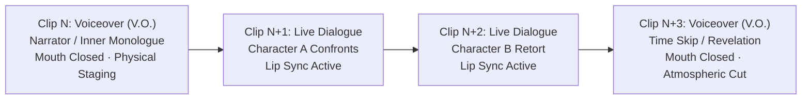
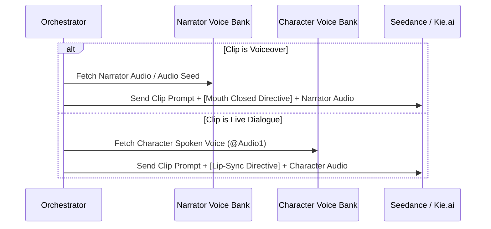

# Hybrid Narrated Drama Architecture Plan
### ReelShort / DramaBox Style: Voiceover Narration + Live Spoken Dialogue

---

## 1. Executive Summary & Objective

Modern viral AI dramas (such as *ReelShort*, *DramaBox*, and high-performing TikTok/YouTube short series) do **not** rely exclusively on non-stop spoken dialogue. Instead, they operate on a high-tension **alternating rhythm**:

1. **Voiceover Narration (V.O.):** Bridges time, delivers exposition, reveals inner thoughts, and builds tension over cinematic establishing or movement shots—**without character lip flap**.
2. **Live Spoken Dialogue (Sync):** Cuts into intimate close-ups or two-shots where characters confront each other with **full lip-synced speech**.

This document outlines the end-to-end engineering roadmap to implement this **Hybrid Narrated Drama Mode** into the AI Video Extender pipeline.

---

## 2. Core Narrative & Visual Dynamics



### The Three Clip Paradigms:

| Mode | Audio Role | Visual / Acting Role | Seedance Mouth Directive |
| :--- | :--- | :--- | :--- |
| **`VOICEOVER`** | Narrator or Character inner monologue (0.5s–4.5s) | Dramatic physical motion (walking away in rain, pouring a drink, glancing out a window) | **Mouth strictly closed** or natural resting expression; zero lip movement to the VO audio. |
| **`DIALOGUE`** | Character on-screen speech (6–12 words, calibrated pacing) | Master two-shot, over-the-shoulder, or tight close-up | **Lip sync strictly active** to the character's banked voice. |
| **`SILENT_ACTION`** | Atmospheric Foley, room tone, environmental cues | Physical tension (aiming a weapon, lock-picking, elevator doors opening) | Neutral breathing, zero speech. |

---

## 3. Architecture & Data Schema Changes

### 3.1 Chapter / Clip JSON Schema (`movie_scene_multispeaker.py`)

Each clip schema in the chapter generator will support a clear `delivery_mode`:

```json
{
  "clip_number": 1,
  "delivery_mode": "voiceover", // "voiceover" | "dialogue" | "silent_action"
  "location_id": "subterranean_bunker",
  "present_characters": ["Sophia", "Liam"],
  "shot": "[SAME SETUP] medium tracking shot",
  "narrator_or_speaker": "Narrator", // or "Sophia (V.O.)" or "Liam"
  "audio_script": "She smiled, but her heart was already miles away on the coast.",
  "action_steps": [
    {
      "second": 0.0,
      "character": "Sophia",
      "action": "Sophia looks out through the steel grating into the pouring rain"
    },
    {
      "second": 2.5,
      "character": "Liam",
      "action": "Liam sits on the edge of the cot cleaning his boots, unnoticing"
    }
  ],
  "blocking": [
    {
      "character": "Sophia",
      "position": "beside the steel window",
      "posture": "standing",
      "screen_profile": "three_quarter_left",
      "eyeline": "downward",
      "in_frame": "center"
    }
  ]
}
```

---

## 4. Prompt Engineering for Seedance / Kie.ai

To prevent Seedance from moving characters' lips when voiceover audio is supplied, we inject **explicit negative and positive physical constraints**:

### 4.1 When `delivery_mode == "voiceover"`:
```text
Five-second medium tracking shot. Location: Subterranean Bunker.
Characters: Sophia is @Image1, Liam is @Image2.
VOICEOVER DIRECTIVE (CRITICAL): An off-screen narrator voiceover plays over this scene. 
The characters on screen DO NOT speak or move their mouths. Keep lips closed with natural facial expression. 
Characters engage solely in physical cinematic acting: Sophia looks out the window, Liam adjusts his boots.
Audio: Off-screen narration only; no on-screen lip movement.
```

### 4.2 When `delivery_mode == "dialogue"`:
```text
Five-second close-up shot. Location: Subterranean Bunker.
Characters: Sophia is @Image1.
DIALOGUE DIRECTIVE: Sophia speaks directly on-camera with synchronized lip movement.
Spoken line: "Die comfortable, sweetheart."
Audio: Voice matches @Audio1 with clear lip synchronization.
```

---

## 5. Voice Banking & Audio Flow



1. **Narrator Bank (`narrator_bank`):**
   * Can use a pre-selected cinematic voice (e.g. Male Noir Narrator, Female Drama Narrator) or generate a consistent reference sample.
   * Kept in `job.narrator_voice` so the tone remains identical across all 60 clips.
2. **Character Voice Bank (`voice_bank`):**
   * Preserved for characters whenever they speak in `dialogue` clips.
3. **FFmpeg Assembly Smoothing:**
   * Narration tracks are given subtle room ambience and balanced volume to match live on-screen dialogue without sudden audio drops.

---

## 6. Master Plan Prompt Calibration (`_outline_prompt`)

The Master Plan generator (`gpt-5.5`) will be directed to distribute beats dynamically:

* **Ideal Ratio for a 5-Minute (60-Clip) Drama:**
  * **30% Voiceover Beats (~18 clips):** Scene transitions, inner realizations, time skips, montage beats.
  * **60% Live Dialogue Beats (~36 clips):** Heated clashes, confessions, twists, betrayals.
  * **10% Silent Action Beats (~6 clips):** Gun racks, sneaking past flashlights, door breaching.
* **Rules Enforced in Python Validation:**
  * No more than **3 consecutive voiceover clips** (prevents turning into a pure slideshow).
  * No more than **4 consecutive dialogue clips** without a visual/narrative breather.
  * Every major Act starts with a high-impact VO hook or sudden disruptive spoken line.

---

## 7. Frontend & Dashboard UI Updates

1. **Mode Option in [`dashboard.html`](file:///e:/AI%20Video%20Extender/AI%20Video%20Extender/dashboard.html):**
   * Add radio choice: **Narrated Drama** (`narrated_drama`) under mode selection:
     ```html
     <label class="choice">
       <input type="radio" name="mode" value="narrated_drama">
       <span>Narrated Drama<small>VO narration + live spoken dialogue</small></span>
     </label>
     ```
2. **Timeline Cards:**
   * Render badges on clips:
     * `[V.O.]` in purple for Voiceover beats.
     * `[SYNC]` in green for Live Spoken Dialogue.
     * `[ACTION]` in blue for Silent Action beats.
3. **Clip Detail View:**
   * Shows whether the line is an off-screen narrator thought or an on-screen spoken line.

---

## 8. Implementation Steps (Phased Roadmap)

| Phase | Tasks | Target Files |
| :---: | :--- | :--- |
| **1** | Define `delivery_mode` in outline & chapter schemas; update directing rules. | [`movie_scene_multispeaker.py`](file:///e:/AI%20Video%20Extender/AI%20Video%20Extender/movie_scene_multispeaker.py) |
| **2** | Update `build_multi_prompt()` to inject Mouth-Closed directives for V.O. clips. | [`movie_scene_multispeaker.py`](file:///e:/AI%20Video%20Extender/AI%20Video%20Extender/movie_scene_multispeaker.py) |
| **3** | Add Narrator Voice configuration and routing in worker execution. | [`app.py`](file:///e:/AI%20Video%20Extender/AI%20Video%20Extender/app.py) |
| **4** | Add "Narrated Drama" UI selector, timeline badges, and detail rendering. | [`dashboard.html`](file:///e:/AI%20Video%20Extender/AI%20Video%20Extender/dashboard.html) |
| **5** | Run test validation with a 75-second sample to inspect voiceover mouth closure. | Live Integration Test |
